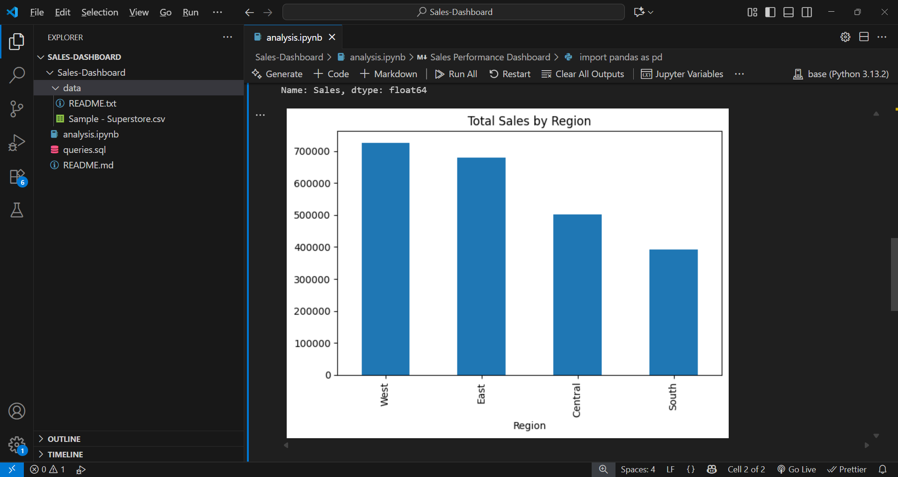

# Sales Performance Dashboard

A simple data analysis project built to study sales patterns and regional performance using **Python, SQL, and Power BI**.  
The goal of this project is to understand which regions, categories, and customers contribute most to the company’s profit.

---

### 🎯 Project Objectives
- Clean and prepare the sales dataset using Python (Pandas)
- Extract key metrics (KPIs) using SQL queries
- Build a Power BI dashboard to visualize trends and insights

---

### 🧩 Key Findings
- The **West** region gives the highest total sales and profit  
- **Repeat customers** generate a major share of revenue  
- **Office Supplies** and **Technology** are among the best-performing categories

---
### 📸 Dashboard Preview 
 
 
---
### 🛠️ Tools & Technologies
- **Python:** Pandas, Matplotlib  
- **SQL:** For KPI extraction and aggregation  
- **Power BI:** Interactive dashboard (to be added soon)  
- **Excel:** For basic review and data understanding

---

### 🧰 How to Run
1. Download the dataset from [Superstore Dataset](https://www.kaggle.com/datasets/vivek468/superstore-dataset-final)  
2. Place `Superstore.csv` inside the `data` folder  
3. Open the `analysis.ipynb` file in VS Code or Jupyter Notebook  
4. Run all cells to generate insights and graphs

---

### 📄 Files Included
- `analysis.ipynb` – Main notebook with data cleaning and visualizations  
- `queries.sql` – SQL file containing KPI queries  
- `data/Sample - Superstore.csv` – Dataset used for analysis  
- `README.md` – This project summary file

---

### 👤 Author
**Aryan Vaid**  
Aspiring Data Analyst | Python • SQL • Power BI  
GitHub: [Aryan250366](https://github.com/Aryan250366)
